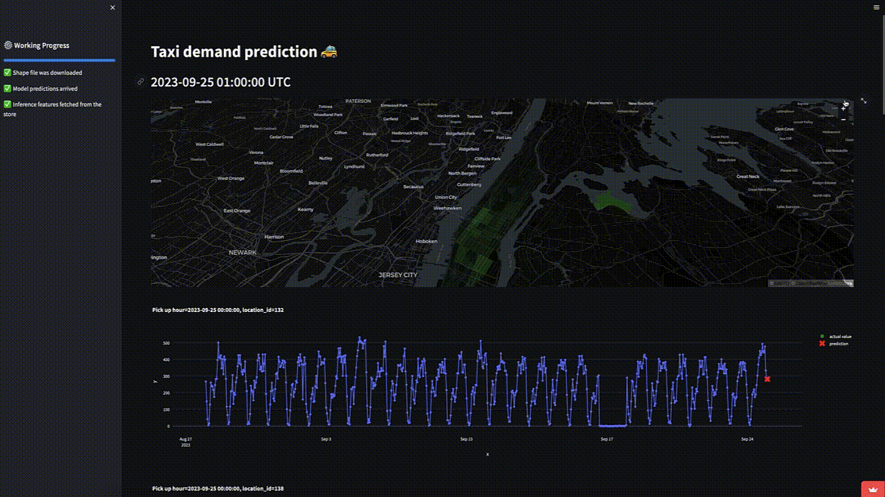

# Taxi Demand Prediction 🚗


<a href="http://linkedin.com/in/carlos-melo-data-science/" alt="linkedin"> </a> 
<a href="http://twitter.com/carlos_melo_py" alt="twitter"> </a> 

Predict the upcoming hour's user demand for NYC taxi. This enables optimization of fleet distribution and potential revenue increase. This guide covers all project aspects, from setup to contribution.


> **Note**: This project is currently a work in progress. I will be making significant updates throughout this week.

<br>

# Table of Contents

- [Demo](#web-app-overview)
- [Code Structure](#code-structure)
- [Installation](#installation)
- [Usage](#usage)
- [Development](#development)
- [Contribute](#contribute)
- [License](#license)

<br>

# Web App Overview

The app employs a trained LightGBM model to predict taxi demands for the next hour. Data from January 2022 onwards is stored in a Feature Store on HopsWorks, and new data is fetched every 60 minutes using GitHub Actions.

[](https://taxi-demand-predictor-sigmoidal.streamlit.app)

The web app serves as an interface to visualize real-time predictions, rendered as a time series plot. It offers filters for location selection and provides monitoring of key performance metrics.

_To be updated with actual project demonstration or guide._
https://taxi-demand-predictor-sigmoidal.streamlit.app

<br>

# Code structure
[(Back to top)](#table-of-contents)

The project follows an organized directory structure, ensuring clarity, modularity, and ease of navigation. Here is a breakdown of the structure:

```
.
├── README.md                     - provides an overview of the project

│   ├── raw                       - contains the raw, unprocessed ride data.
│   │   ├── rides_2022-01.parquet 
│   │   ├── rides_2022-02.parquet 
│   │   └── ...
│   └── transformed               - contains datasets that have undergone some form of processing
│       ├── tabular_data.parquet  
│       ├── ts_data_rides_2022_01.parquet  
│       └── validated_rides_2022_01.parquet 
│       └── ... 
├── models                        - any machine learning models.
├── notebooks                     - exploratory and developmental Jupyter notebooks.
│   ├── 01_load_and_validate_raw_data.ipynb
│   ├── 02_transform_raw_data_into_ts_data.ipynb
│   ├── 03_transform_ts_data_into_features_and_targets.ipynb
│   ├── ...
├── pyproject.toml                - project metadata and dependencies
├── scripts                       - scripts for automation, data collection, and other utilities.
├── src                           - directory containing reusable code, functions, and classes.
└── tests                         - test scripts for functionalities
```

<br>

# Installation
[(Back to top)](#table-of-contents)

To get started, you'll need to clone this repository and set up the environment:

```shell
git clone https://github.com/carlosfab/taxi_demand_predictor
cd taxi_demand_predictor
poetry install
poetry shell
```

