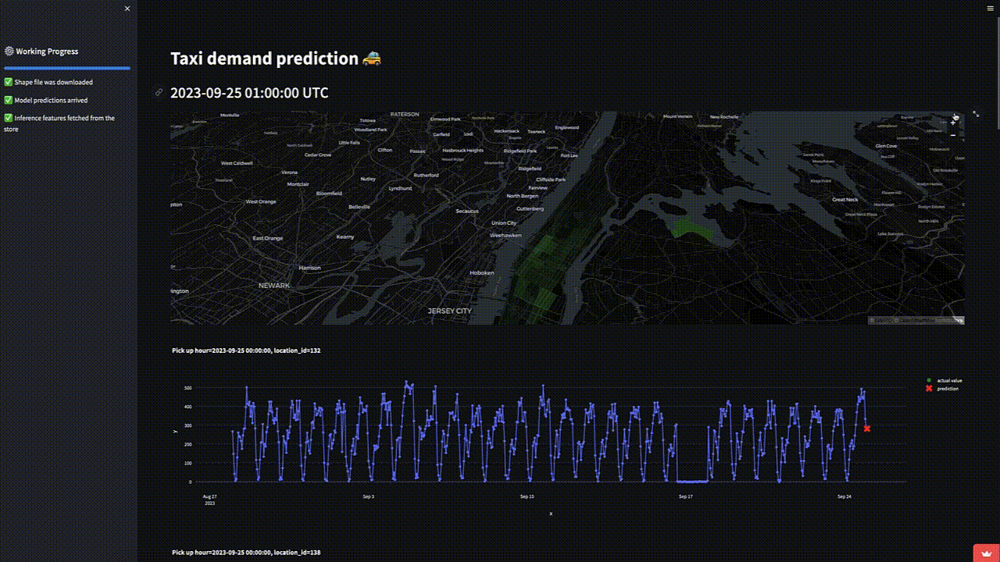
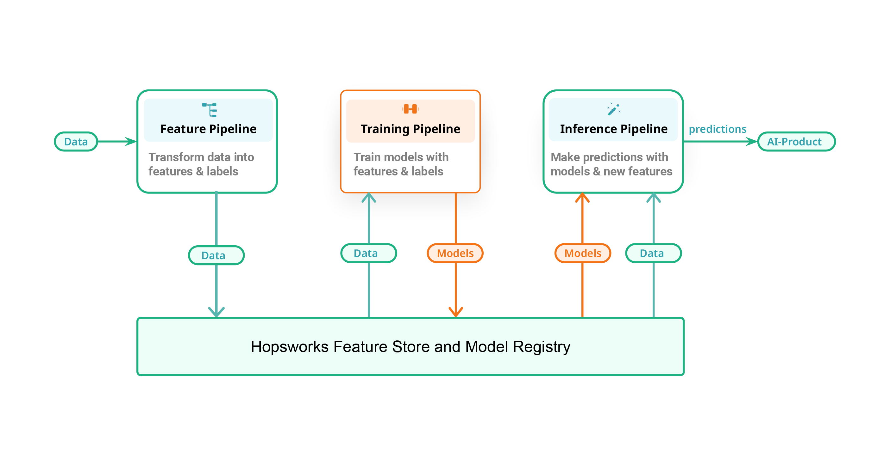

# Taxi Demand Prediction 🚗

<a href="http://linkedin.com/in/carlos-melo-data-science/" alt="linkedin"></a>
<a href="http://linkedin.com/in/carlos-melo-data-science/" alt="linkedin"> </a> 
<a href="http://twitter.com/carlos_melo_py" alt="twitter"> </a> 

Predict the upcoming hour's user demand for NYC taxi. This enables optimization of fleet distribution and potential revenue increase. This guide covers all project aspects, from setup to contribution.



> **Note**: This project is currently a work in progress. I will be making significant updates throughout this week.

<br><br>

# Table of Contents

- [Web App Overview](#web-app-overview)
- [Feature/Training/Inference Pipelines](#fti-pipelines)
- [Code Structure](#code-structure)
- [Installation](#installation)
- [Usage](#usage) *(Upcoming)*
- [Development](#development) *(Upcoming)*
- [Contribute](#contribute) *(Upcoming)*
- [License](#license) *(Upcoming)*

<br><br>

# Web App Overview

The app employs a trained LightGBM model to predict taxi demands for the next hour. Data from January 2022 onwards is stored in a Feature Store on HopsWorks, and new data is fetched every 60 minutes using GitHub Actions.

[](https://taxi-demand-predictor-sigmoidal.streamlit.app)

The web app serves as an interface to visualize real-time predictions, rendered as a time series plot. It offers filters for location selection and provides monitoring of key performance metrics.

<!-- _To be updated with actual project demonstration or guide._
https://taxi-demand-predictor-sigmoidal.streamlit.app -->

<br>

# Feature/Training/Inference Pipelines
[(Back to top)](#fti-pipelines)

The MLOps strategy adopted here is built upon the FTI (Feature, Training, Inference) architecture. This architecture was proposed by Jim Dowling (CEO and Co-Founder of HopsWorks) and provides a unified structure that describes both batch ML systems and real-time ML systems. It does so primarily by categorizing operations into three well-defined and separate pipelines.

A significant part of the development process is prototyping and experimentation. In this project, Jupyter notebooks have been employed extensively for this purpose. Here's a breakdown of the notebooks corresponding to each of the FTI pipelines:



## 📊 Feature Pipeline

The feature pipeline systematically fetches, transforms, and stores refined time-series taxi data, making it ready for machine learning model consumption and other analytics purposes.

| **Notebook** | **Description** |
|:-------------|:----------------|
| [**11_backfill_feature_store.ipynb**](https://github.com/carlosfab/taxi_demand_predictor/blob/main/notebooks/11_backfill_feature_store.ipynb) | The notebook downloads and consolidates raw taxi ride data from a specified range of years, transforms this data into a time-series format, and then uploads it to a centralized feature store. |
| [**12_simulated_feature_pipeline.ipynb**](https://github.com/carlosfab/taxi_demand_predictor/blob/main/notebooks/12_simulated_feature_pipeline.ipynb) | The notebook fetches a batch of raw data simulating recent production information by adjusting historical data, transforms it into a time-series format, and subsequently populates a feature store with this data. |

## 🎯 Training Pipeline

The Training Pipeline involves setting up data infrastructure, preprocessing, feature extraction, model training, and hyperparameter tuning to create a robust machine learning model.

| **Notebook** | **Description** |
|:-------------|:----------------|
| [**13_model_training_pipeline.ipynb**](https://github.com/carlosfab/taxi_demand_predictor/blob/main/notebooks/13_model_training_pipeline.ipynb) | This notebook establishes a training pipeline, creating a feature view, transforming time-series data into features and targets, splitting the data into training and testing sets, and tuning a LightGBM model using Optuna. |

## 🤖 Inference Pipeline

The Inference Pipeline is structured to retrieve the latest data, process it, utilize a pre-trained model for prediction, and store the outputs efficiently for downstream applications.


| **Notebook** | **Description** |
|:-------------|:----------------|
| [**14_inference_pipeline.ipynb**](https://github.com/carlosfab/taxi_demand_predictor/blob/main/notebooks/14_inference_pipeline.ipynb) | This notebook fetches recent data, predicts taxi demand using LightGBM, and saves predictions to a feature store. |


For those interested in the granular details and the intricate processes behind each pillar of the architecture, the notebooks serve as a comprehensive guide. They offer code, visualizations, and explanations that provide clarity on the MLOps strategies employed in the project.

<br>

# Code structure
[(Back to top)](#code-structure)

The project follows an organized directory structure, ensuring clarity, modularity, and ease of navigation. Here is a breakdown of the structure:

```
.
├── README.md                     - provides an overview of the project

│   ├── raw                       - contains the raw, unprocessed ride data.
│   │   ├── rides_2022-01.parquet 
│   │   ├── rides_2022-02.parquet 
│   │   └── ...
│   └── transformed               - contains datasets that have undergone some form of processing
│       ├── tabular_data.parquet  
│       ├── ts_data_rides_2022_01.parquet  
│       └── validated_rides_2022_01.parquet 
│       └── ... 
├── models                        - any machine learning models.
├── notebooks                     - exploratory and developmental Jupyter notebooks.
│   ├── 01_load_and_validate_raw_data.ipynb
│   ├── 02_transform_raw_data_into_ts_data.ipynb
│   ├── 03_transform_ts_data_into_features_and_targets.ipynb
│   ├── ...
├── pyproject.toml                - project metadata and dependencies
├── scripts                       - scripts for automation, data collection, and other utilities.
├── src                           - directory containing reusable code, functions, and classes.
└── tests                         - test scripts for functionalities
```

<br>

# Installation
[(Back to top)](#table-of-contents)

To get started, you'll need to clone this repository and set up the environment:

```shell
git clone https://github.com/carlosfab/taxi_demand_predictor
cd taxi_demand_predictor
poetry install
poetry shell
```

